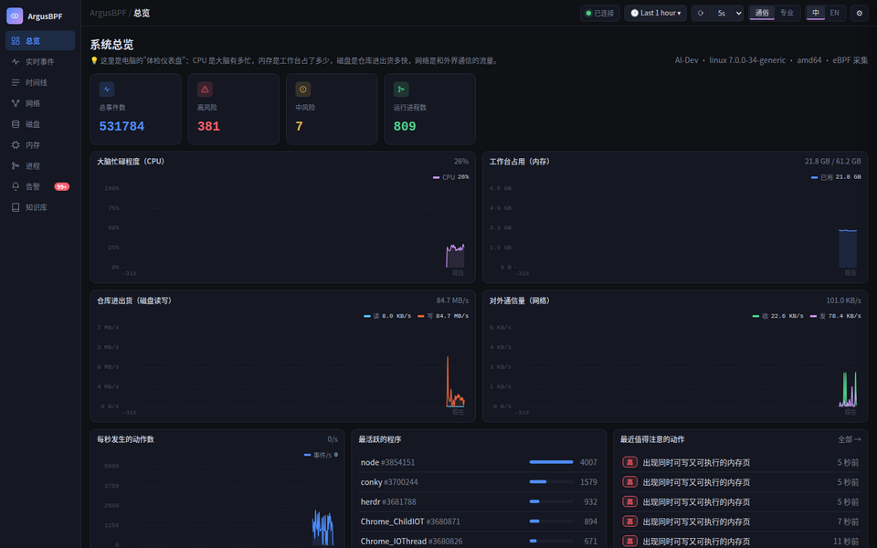
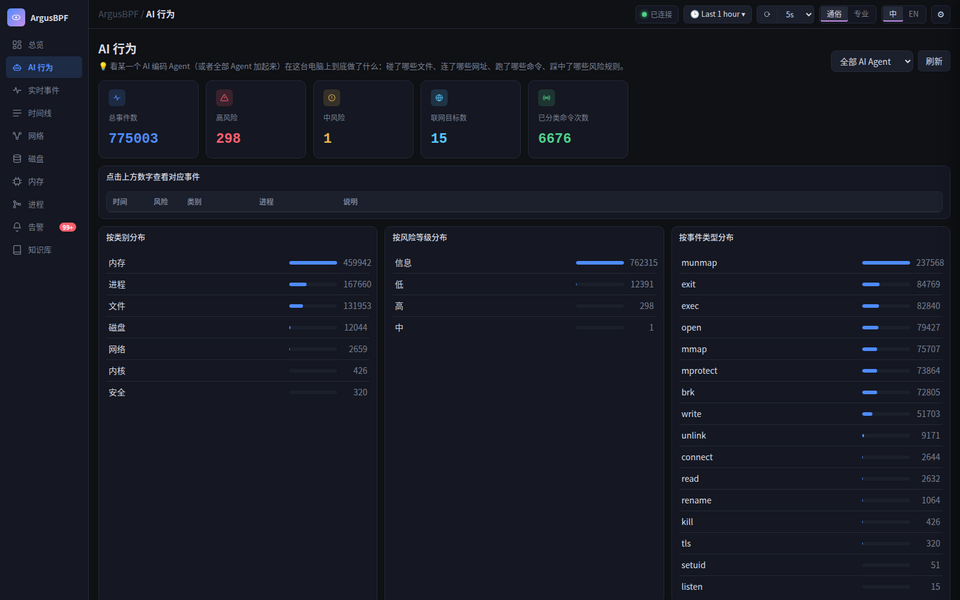
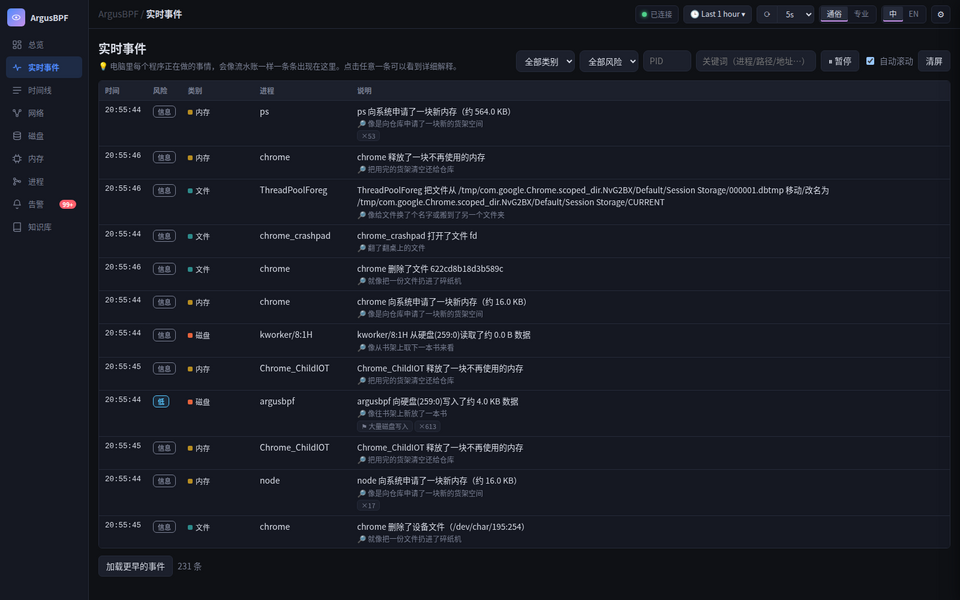
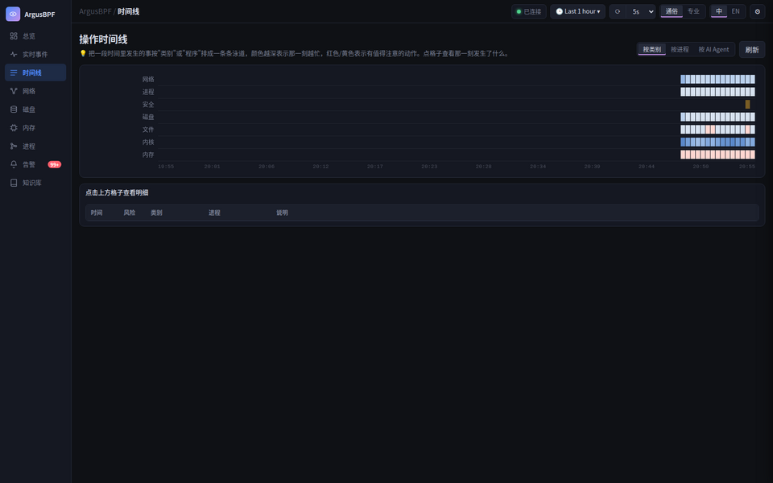
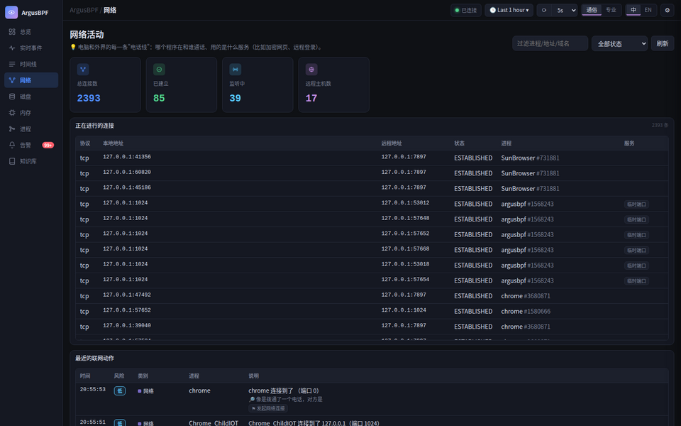
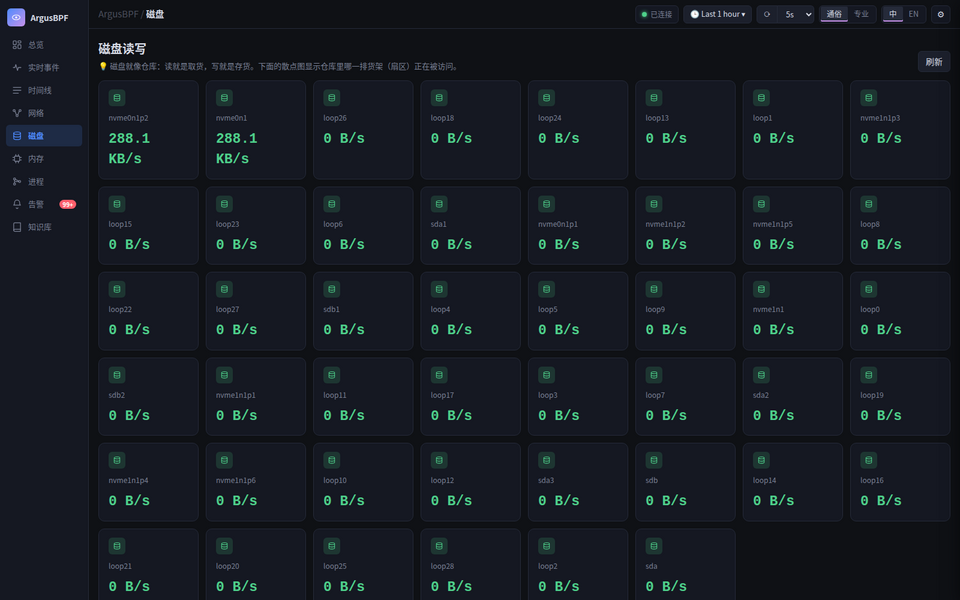
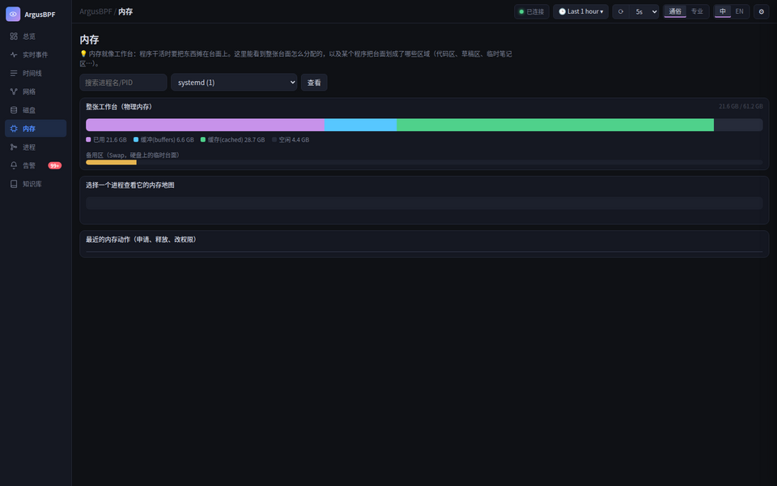
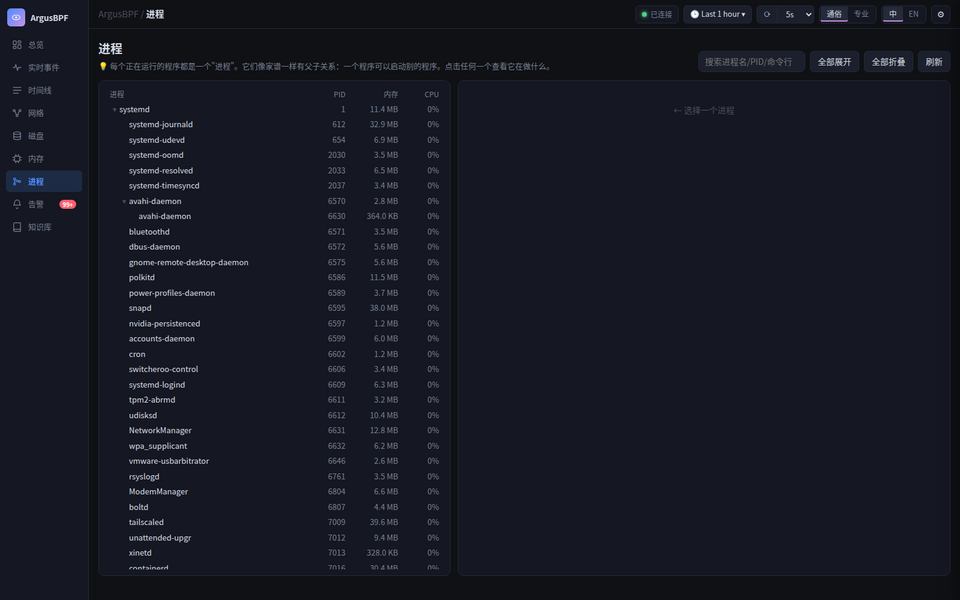
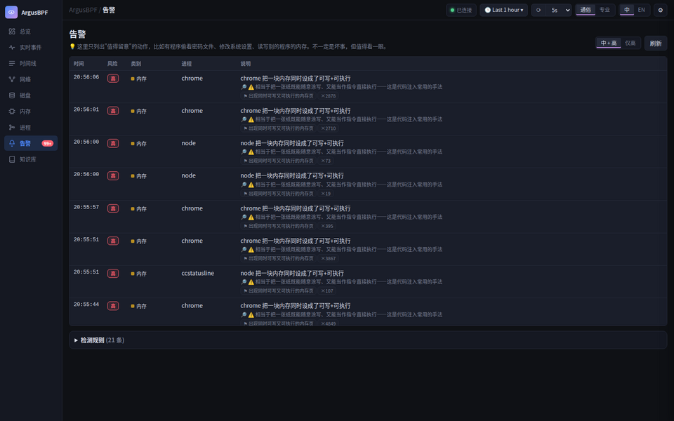
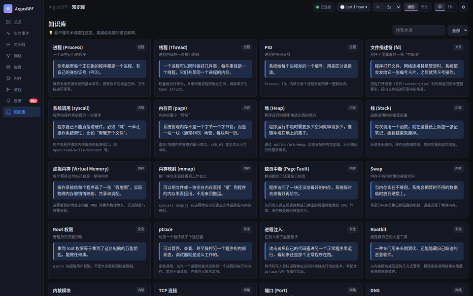

# ArgusBPF

*[English](README.md)*

**通过 eBPF 实时查看操作系统在做什么——以及运行在它上面的每一个 AI 编码 Agent 在做什么——用通俗易懂的语言解释，而不是一堆 syscall 术语。**

项目名字里的 Argus 取自希腊神话里的百眼巨人，呼应它做的两件事：直接挂钩内核观察系统调用（eBPF），同时能识别出当前活动是不是来自某个 AI Agent CLI。

ArgusBPF 是一个单文件 Go 二进制程序。在 Linux/amd64 上以 root 运行时，它通过 **eBPF**（CO-RE，运行时无需内核头文件）直接挂钩内核；在其它平台（其它系统、其它架构、无 root）会自动降级为基于 [gopsutil](https://github.com/shirou/gopsutil) 的跨平台轮询采集。Web UI 里可以随时切换**专业模式**（syscall 原始形态、内存地址、扇区号、原始字段）和**通俗模式**（同一个事件换成日常语言+生活类比来解释）。

思路上和 CC-Monitor 一类监控 AI 编码助手对电脑做了什么的工具类似，只是这次监控对象是操作系统本身，并且进一步识别出是哪个 AI Agent CLI 在动手。

## 界面截图

### 总览



### AI 行为



### 实时事件



### 时间线



### 网络



### 磁盘



### 内存



### 进程



### 告警



### 知识库



## 核心设计

- **单一内核态分发器，不是逐进程 ptrace。** 一个 CO-RE 程序（`bpf/monitor.c`）挂在 `raw_syscalls/sys_enter` 以及 `module_load`/`block_rq_issue` 这几个 tracepoint 上，覆盖全系统所有进程，没有 ptrace 那种逐进程挂载的开销，换内核版本也不用重新编译（运行时不需要内核头文件）。
- **按进程身份识别 AI Agent。** 内置 10 款主流 AI 编码 Agent CLI 的进程识别规则，命中后事件会带上 `agent` 字段、在实时流里显示徽标、在时间线上有独立车道，可以单独查看某个 Agent 碰过什么。
- **TLS/DNS/SQL 明文捕获。** eCapture 风格的 uprobe 挂在 `SSL_read`/`SSL_write`/`getaddrinfo`/`exec_simple_query` 上，在目标进程自己的内存里、加密前/解密后直接取得明文，不需要中间人代理或处理证书。
- **每个事件两种描述。** 同一个事件会生成两份独立文本：syscall 原始形态的专业版，以及带生活类比的通俗版，由离线模板/查表引擎生成（不调用 LLM，完全确定性，离线也能跑）。
- **单二进制，跨平台。** 纯 Go，不依赖 CGO（含 SQLite）。root + Linux/amd64 时走完整 eBPF 链路；其它系统/架构，或没有 root 权限时，自动切换为基于 gopsutil 的轮询采集。

## 功能

- **AI Agent 识别**：每个事件的进程都会去比对一张主流 AI 编码 Agent CLI 的名单（Claude Code、Codex、Cursor、Gemini CLI、Grok CLI、Aider、OpenCode、ZCode、OpenClacky、Antigravity CLI——和 CC-Monitor dev 分支上维护的那张名单一致）；命中的事件会带上 `agent`/`agent_display` 字段，在实时事件流里挂一个 🤖 徽标，时间线页面还有一条专门的"按 AI Agent"车道，让你能单独看某个 Agent 到底动了什么，和机器上其它一切活动分开。
- **实时事件流**：exec、文件 open/write/unlink/rename、网络 connect/listen、mmap/mprotect/ptrace/跨进程内存访问、内核模块加载、磁盘块 IO，通过 WebSocket 实时推送。
- **风险规则**：一份小巧的 JSON 规则集（可编辑、可被用户覆盖），标记诸如读取 `/etc/shadow`、可写+可执行内存页、`ptrace` 附加、跨进程内存写入、内核模块加载、SSH 活动等，分为 info/low/medium/high 四档。
- **通俗解释**：每个事件都同时拥有一句专业描述（`mprotect(addr=0x7f.., prot=RWX)`）和一句带生活类比的通俗解释，由离线的模板/查表引擎生成（不调用任何 LLM，完全确定性）。
- **eCapture 风格的应用层探针**：在 `getaddrinfo`（DNS）、OpenSSL 的 `SSL_read`/`SSL_write`（TLS 明文）、Postgres 的 `exec_simple_query`（SQL 语句）上按需挂载 uprobe；目标库/程序存在时自动挂载，不存在时优雅跳过并在 `/api/info` 中给出提示。
- **完整的 Web 仪表盘**：总览页（实时 CPU/内存/磁盘/网络曲线）、实时事件表、泳道式时间线（按类别/按进程/按 AI Agent）、网络连接、磁盘 IO（含扇区级散点图）、按进程的内存地图（可视化并逐段解释 `/proc/<pid>/maps`）、进程树、告警页、术语知识库——视觉风格参考 Grafana（深色面板网格、图例、时间范围选择器），但完全自包含，不需要安装真正的 Grafana。
- **天生跨平台**：纯 Go，无 CGO（SQLite 使用 `modernc.org/sqlite`）。可编译到 darwin/windows/linux 的 amd64/arm64；只有 eBPF 采集器是 linux/amd64 专属的，其余部分到处都能跑。
- **可选的 PTY 网页终端**（`--enable-terminal`，默认关闭）：直接在仪表盘里开一个真实终端，运行任何东西（AI Agent CLI、shell 都行），支持多会话并发和网格视图同屏查看。这和项目其余部分"纯只读观测"的信任模型完全不同——它能真实起进程、驱动进程——所以特意做成显式开关，而不是仪表盘自带的常规功能。**打开它的话，务必同时设置 `--token`，并保持 `--listen` 绑定在本机（默认就是）或放在你自己的反向代理后面**——任何能连上这个端口的人都能打开一个 shell。

## 快速开始

```sh
# 编译（不需要 clang/bpftool —— eBPF 对象文件已预编译好并提交到仓库）
make build

# 以 root 运行才能用 eBPF 采集；无 root 会自动降级为轮询模式
sudo ./argusbpf

# 打开仪表盘
open http://127.0.0.1:1024
```

常用参数：

| 参数 | 默认值 | 含义 |
|---|---|---|
| `--listen` | `127.0.0.1:1024` | HTTP 监听地址 |
| `--token` | *(无)* | 要求请求带 `X-Token` 头 / `?token=` 参数 |
| `--db` | `~/.argusbpf/events.db` | SQLite 数据库路径 |
| `--rules` | `~/.argusbpf/rules.json` | 覆盖内置风险规则集 |
| `--enable-terminal` | `false` | 启用 PTY 网页终端（见上文"功能"一节——打开后记得也设置 `--token`） |

## 从源码编译 eBPF 程序

仓库里已经提交了预编译好的 `internal/collector/monitor_x86_bpfel.o`，所以 `make build` 不需要 clang。如果你修改了 `bpf/monitor.c`：

```sh
make vmlinux   # 导出本机内核的 BTF -> bpf/vmlinux.h（需要 bpftool）
make bpf       # 重新编译 monitor.c -> .o/.go 文件对（需要 clang、llvm-strip）
make build
```

## 架构

完整设计（事件模型、采集管线、风险规则、专业/通俗双解释引擎、`web/` 所用的 HTTP/WebSocket API 契约）见 [DESIGN.zh-CN.md](DESIGN.zh-CN.md)。

```
采集器 (eBPF | 轮询) -> 管线 (规则 + 解释 + 1秒聚合) -> SQLite + WebSocket Hub -> Web UI
```

## 平台支持

| 系统/架构 | 采集方式 | 说明 |
|---|---|---|
| Linux/amd64，root | eBPF (CO-RE) | 细节最全：syscall 参数、内存地址、扇区号 |
| Linux/amd64，非 root | 轮询 | 自动降级 |
| Linux/arm64 | 轮询 | eBPF 的 syscall 号表目前只做了 amd64 |
| macOS、Windows | 轮询 | 基于 gopsutil 的进程/连接差分 |

## 已知局限

- 未实现 MySQL `dispatch_command` 的 SQL 捕获——其参数结构随版本变化太大，风险高，暂不提供；Postgres 的 `exec_simple_query`（单个 `char*` 参数，签名稳定）已实现。
- 暂无 `bash readline` 命令审计 uprobe。
- eBPF 路径暂未单独捕获入站连接（`accept`）；磁盘页的"按文件统计 IO"暂无数据源（目前只有按进程统计和扇区散点图）。
- Postgres 的 `exec_simple_query` 在发行版打包的二进制里通常是 LTO+strip 过的，`install.sh` 的 uprobe 挂载会自动尝试用匹配的 `-dbgsym` 调试符号包按地址挂载作为兜底；没装调试符号包时这部分能力就不可用。
